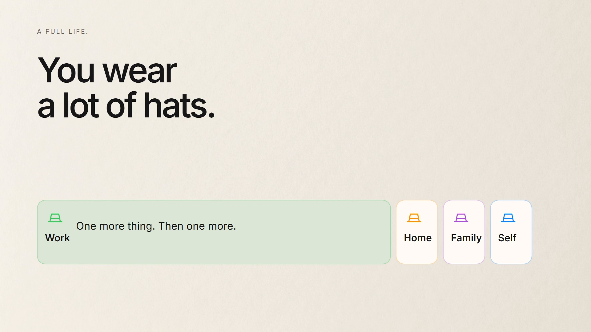
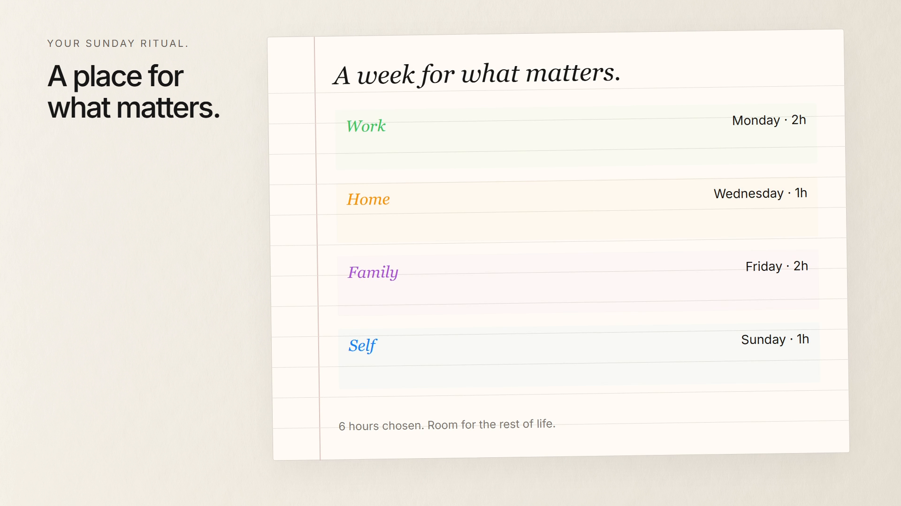
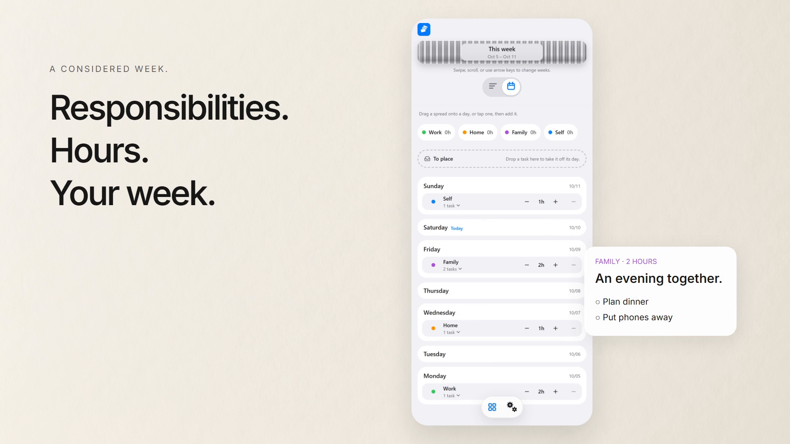
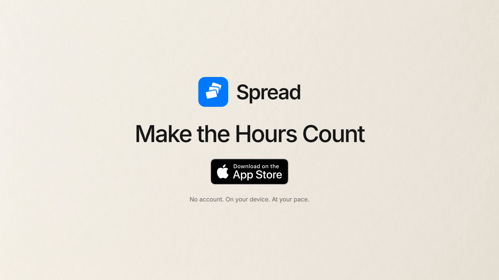

# Approved v7 reference gallery

These are frames extracted from the preserved, user-approved [Hallie v7 MP4](../deliverables/Spread-Make-the-Hours-Count-Hallie-Pivot-v7.mp4), SHA256 `ABF16A41C6786A6187786D0B833FBD88A9329940918D9E6D22B9FB9BA83A94AB`. They were carried forward from verified export QA; they are not newly generated illustrations. Watch the full cut for cadence, transitions and mix. The [Grady companion](../deliverables/Spread-Make-the-Hours-Count-Grady-v7.mp4) uses the same art with timing adapted to his speech.

| Beat | Hallie start frame / seconds | Grady start frame / seconds | What to preserve |
| --- | --- | --- | --- |
| Many hats / unequal time | 0 / 0 | 0 / 0 | Recognizable overload without a rendered person |
| Pause / invitation | 288 / 9.600 | 261 / 8.700 | Agency, inviting So and room to think |
| Paper / responsibilities / boxes / purpose / tasks | 392 / 13.067 | 360 / 12.000 | Same example data; writing follows phrases |
| Paper becomes Spread | 623 / 20.767 | 573 / 19.100 | Blocks retain identity through the morph |
| Responsibilities → hours → week → tasks | 713 / 23.767 | 653 / 21.767 | Verified product imagery and clear hierarchy |
| Make the Hours Count | 838 / 27.933 | 825 / 27.500 | Exact tagline, official badge and readable hold |

Scene starts are captured from the original v7 source in [ASSETS.json](../ASSETS.json). Times above are frame boundaries rounded to milliseconds; they are not speech-cut timestamps.

## Overload — 4.0 seconds

## A deliberate paper plan — 15.5 seconds

## The product resolves the plan — 26.9 seconds

## The ending — 29.6 seconds

